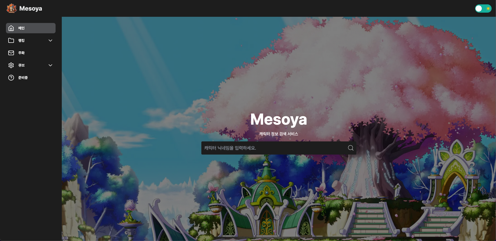

<p align="center">
  
</p>

</br>
  <h3 align="center"><a href="https://mesoya.kr">Mesoya 바로가기</a></h1>
  <h1 align="center">캐릭터 정보 검색 서비스</h2>
  <h3 align="center">개발 진행중...ing</h3>

</br>

## 프로젝트 소개

```
1) 프로젝트 설명
Nexon Open API를 활용하여 메이플스토리 캐릭터 정보 검색 사이트 및 게임 내 정보 전달 웹사이트를 구현
이전 프로젝트들과 달리 이번 프로젝트는 단발성이 아니라 실제 서비스를 목표로 하여 반응형으로 제작

2) 개발 개요 및 배경
새로운 프로젝트 아이디어가 생겨 개발을 해보려고 하는데, 이를 위해 관심이 있었던 최신 기술 스택을 실제로 사용해보기로 결정하여
새로운 스택들을 추가해서 사용할 예정(Next14, React-query, tailwind)
```

## 기술스택

<div>
&nbsp 
&nbsp 
&nbsp 
&nbsp
&nbsp 
 </div>

## 서비스 실행

```
git clone https://github.com/Corete95/Mesoya.git

cd Mesoya
npm install
npm run dev
```

## 폴더구조

<details>
<summary>현재 폴더구조 펼쳐보기</summary>
<div markdown="1">

```

```

</div>
</details>
